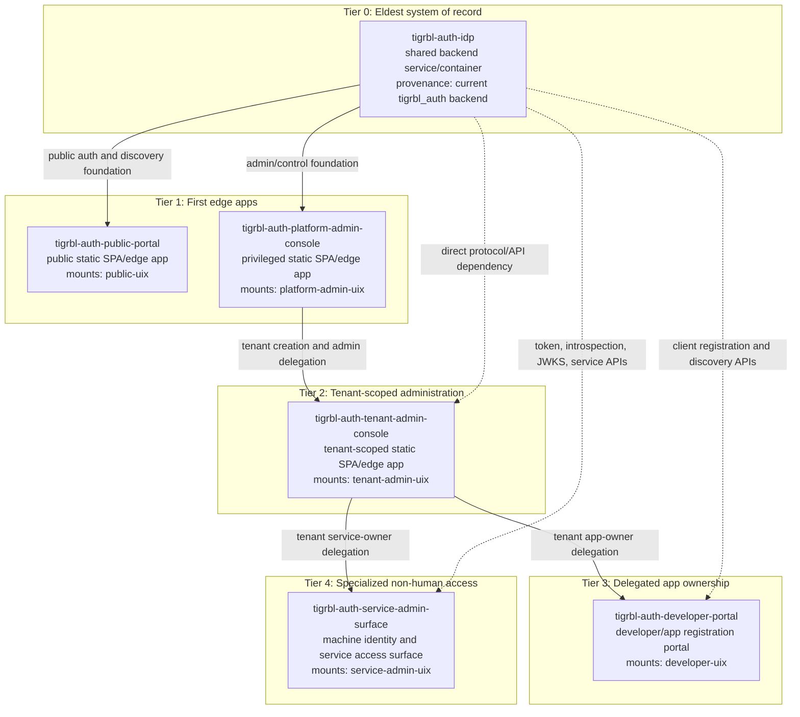

> [!WARNING]
> Non-authoritative active document.
> Use this as a future-state provenance note, not as certification or release truth.
> For current executable and release truth, use `docs/compliance/AUTHORITATIVE_CURRENT_DOCS.md`, `CURRENT_STATE.md`, and the generated reference surfaces.

# App Provenance Tiered Graph

This graph orders the future-state app surfaces by provenance.

In this note, provenance means operational ancestry: which surface must exist first, and which surface grants the authority or context needed for a lower surface to operate. It is not a package import graph and it is not a complete network call graph.

See `docs/architecture/PRINCIPAL_INTERACTION_MATRICES.md` for the principal populations that use or operate these surfaces.

## Tiered graph

## Provenance matrix

| Tier | App | Eldest ancestor | Immediate provenance parent | Why it sits here |
|---|---|---|---|---|
| 0 | `tigrbl-auth-idp` | itself | none | It is the shared backend identity plane and source of protocol/control-plane truth. |
| 1 | `tigrbl-auth-public-portal` | `tigrbl-auth-idp` | `tigrbl-auth-idp` | It is the first public edge app over the IDP public lane. |
| 1 | `tigrbl-auth-platform-admin-console` | `tigrbl-auth-idp` | `tigrbl-auth-idp` | It is the first privileged edge app over the IDP admin/control lane. |
| 2 | `tigrbl-auth-tenant-admin-console` | `tigrbl-auth-idp` | `tigrbl-auth-platform-admin-console` | A tenant admin console becomes useful after a tenant exists and platform authority delegates tenant admin power. |
| 3 | `tigrbl-auth-developer-portal` | `tigrbl-auth-idp` | `tigrbl-auth-tenant-admin-console` | App developers operate inside a tenant context, usually by tenant-admin delegation. |
| 4 | `tigrbl-auth-service-admin-surface` | `tigrbl-auth-idp` | `tigrbl-auth-tenant-admin-console` | Service owners operate lower than tenant administration because machine identities are tenant-scoped or delegated operational assets. |

## Delivery reading

| Delivery order | App | Delivery stance |
|---|---|---|
| 1 | `tigrbl-auth-idp` | Deliver first as the independent backend service/container. |
| 2 | `tigrbl-auth-public-portal` | Deliver as the public edge app mounting `public-uix`. |
| 3 | `tigrbl-auth-platform-admin-console` | Deliver as the privileged admin edge app mounting `platform-admin-uix`. |
| 4 | `tigrbl-auth-tenant-admin-console` | Extract from current admin flows after platform authority is explicit. |
| 5 | `tigrbl-auth-developer-portal` | Promote from tenant-admin module to standalone portal when app owner self-service is required. |
| 6 | `tigrbl-auth-service-admin-surface` | Keep modular until machine/service identity workflows are stable enough for a standalone app. |

## Interpretation rules

| Rule | Meaning |
|---|---|
| Elder surfaces sit higher | A higher tier provides runtime truth, authority, or tenant context to lower tiers. |
| Direct API calls do not imply provenance | Lower-tier apps still call `tigrbl-auth-idp` directly, but their product authority may come from platform or tenant delegation. |
| Sibling tier does not mean same audience | `public-portal` and `platform-admin-console` both branch directly from the IDP, but one is public and one is privileged. |
| Lower tier means more specialized | Developer and service surfaces should be delivered after the broader tenant and platform boundaries are stable. |
