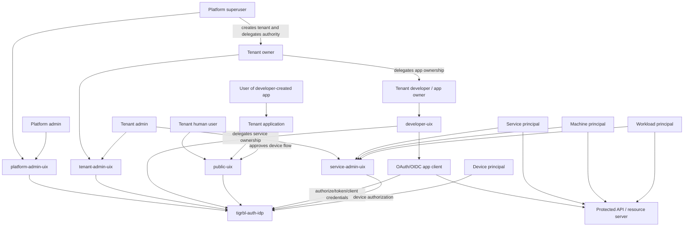

> [!WARNING]
> Non-authoritative active document.
> Use this as a future-state principal interaction note, not as certification or release truth.
> For current executable and release truth, use `docs/compliance/AUTHORITATIVE_CURRENT_DOCS.md`, `CURRENT_STATE.md`, and the generated reference surfaces.

# Principal Interaction Matrices

This note maps the current and planned principal populations to the apps, UIXs, and backend surfaces they should interact with.

The current runtime has concrete `User`, `Client`, `Service`, `ApiKey`, `ServiceKey`, `ClientRegistration`, and `DeviceCode` models. The planned package-level principal model adds first-class `user`, `admin`, `service`, `app`, `machine`, `workload`, and `device` kinds, with `admin`, `owner`, and `superuser` authority roles.

## Principal inventory

| Principal or identity object | Current state | Future-state interpretation | Actor? |
|---|---|---|---|
| Tenant | concrete `Tenant` model | trust domain, namespace, issuer/JWKS boundary | no |
| Platform superuser | `User` with `is_superuser` | deployment-wide authority role over all tenants | yes |
| Platform admin | `User` with `is_admin` | privileged operator, but not tenant-provisioning root unless superuser | yes |
| Tenant owner | planned `owner` authority role | accountable tenant authority that can delegate tenant administration | yes |
| Tenant admin | `User` with `is_admin`; planned tenant-scoped admin role | tenant-local operator for users, keys, clients, policy | yes |
| Tenant human user | concrete `User` without admin flags | ordinary human subject for login, consent, profile, and app use | yes |
| Tenant developer / app owner | planned delegated role over client/app resources | human operator who manages OIDC/OAuth apps inside a tenant | yes |
| OAuth/OIDC app client | concrete `Client` plus `ClientRegistration`; planned `app` principal | relying party, OAuth client, or application integration identity | yes |
| Service principal | concrete `Service` plus `ServiceKey`; planned `service` principal | named non-human service identity | yes |
| Machine principal | planned `machine` principal | host, node, runner, or automation identity | yes |
| Workload principal | planned `workload` principal | federated runtime workload identity | yes |
| Device principal | planned `device` principal; current `DeviceCode` flow artifact | constrained device or CLI authorization actor | yes |
| API key | concrete `ApiKey` bound to `User` | credential proving control of a user principal | no |
| Service key | concrete `ServiceKey` bound to `Service` | credential proving control of a service principal | no |
| Bootstrap admin API key | current admin gate credential | emergency/local control-plane credential, not a durable principal | no |
| Subject alias | planned package object | external issuer/subject alias for a principal | no |
| Tenant membership | planned package object | relation between a principal and tenant-scoped roles | no |

## Human principal matrix

| Principal | What they should do | Primary UIX | Primary app | Backend surfaces | Interacts with |
|---|---|---|---|---|---|
| Platform superuser | create/delete tenants, assign tenant owners/admins, bootstrap authority, inspect cross-tenant posture | `platform-admin-uix` | `tigrbl-auth-platform-admin-console` | `/admin/auth/*`, `/admin/tenants`, `/admin/identities`, `/rpc` | tenants, tenant admins, platform admins, IDP control plane |
| Platform admin | operate permitted platform workflows, inspect tenant/control-plane state, support tenant operations without root tenant authority | `platform-admin-uix` | `tigrbl-auth-platform-admin-console` | `/admin/auth/*`, `/admin/tenants`, `/admin/identities`, `/rpc` | tenants, audit/control-plane views |
| Tenant owner | own the tenant boundary, delegate tenant admins, approve sensitive tenant policy/key posture | `tenant-admin-uix` | `tigrbl-auth-tenant-admin-console` | `/admin/auth/*`, `/admin/identities`, `/rpc`, tenant discovery/JWKS | tenant admins, developers, service owners, tenant keys |
| Tenant admin | create users/principals, issue credentials, rotate tenant keys, manage tenant clients/policy inside the tenant | `tenant-admin-uix` | `tigrbl-auth-tenant-admin-console` | `/admin/auth/*`, `/admin/identities`, `/rpc`, tenant discovery/JWKS | tenant users, tenant developers, service principals, OIDC clients |
| Tenant human user | log in, register, consent, recover account, manage profile, use tenant applications | `public-uix` | `tigrbl-auth-public-portal` | `/authorize`, `/token`, `/userinfo`, `/logout`, `/register`, tenant discovery | tenant apps, public portal, IDP public lane |
| Tenant developer / app owner | register apps, manage redirect URIs, rotate client secrets/JWKS metadata, read integration metadata | `developer-uix` | `tigrbl-auth-developer-portal` | `/register`, `/register/{client_id}`, `/rpc` client methods, tenant discovery | OIDC clients, tenant admin delegation, public portal via app login flows |
| User of a developer-created app | use the tenant app and authenticate through the tenant namespace | `public-uix` during auth only | tenant-owned application, then `tigrbl-auth-public-portal` for auth | `/authorize`, `/token`, `/userinfo`, tenant discovery | tenant app, public portal, IDP public lane |

## Non-human principal matrix

| Principal | What they should do | Primary UIX or owner surface | Primary app | Backend surfaces | Interacts with |
|---|---|---|---|---|---|
| OAuth/OIDC app client | initiate auth redirects, exchange codes, use client credentials when configured, receive tokens, identify itself to the IDP | `developer-uix` for management | `tigrbl-auth-developer-portal` for management, `tigrbl-auth-idp` at runtime | `/authorize`, `/token`, `/register`, `/register/{client_id}`, `/par`, `/introspect`, discovery | tenant users, public portal, protected APIs, developer owners |
| Service principal | authenticate as a named service, hold service keys, access protected resources, support automation | `service-admin-uix` | `tigrbl-auth-service-admin-surface` | API-key/service-key auth, `/token`, `/introspect`, JWKS | protected APIs, tenant admins, service owners |
| Machine principal | represent a host, runner, node, or automation process with bounded trust | `service-admin-uix` | `tigrbl-auth-service-admin-surface` | future machine control methods, `/token`, `/introspect`, JWKS | service principals, workloads, protected APIs |
| Workload principal | exchange workload assertions for tokens, bind runtime identity to tenant trust | `service-admin-uix` | `tigrbl-auth-service-admin-surface` | JWT bearer assertion grant, future workload federation methods, `/token` | workload provider, IDP token service, protected APIs |
| Device principal | request device authorization, poll for completion, receive tokens after human approval | `public-uix` for human approval; no full admin UIX by default | device/CLI client plus `tigrbl-auth-public-portal` for verification | `/device_authorization`, `/token`, public verification flow | tenant human user, OAuth client, IDP token service |

## Credential and relationship object matrix

| Object | What it does | Owned by | Interacts with | Should not be treated as |
|---|---|---|---|---|
| `ApiKey` | proves control of a user principal for API-style access | tenant user or admin | API key backend, protected APIs, IDP auth dependencies | a standalone principal |
| `ServiceKey` | proves control of a service principal | service owner or tenant admin | service-key backend, protected APIs | a standalone principal |
| `ClientRegistration` | stores durable dynamic-registration metadata for an OAuth client | developer/app owner or tenant admin | `/register`, `/register/{client_id}`, client registration RPC | a human actor |
| `DeviceCode` | stores device authorization lifecycle state | OAuth client/device flow | `/device_authorization`, `/token`, public verification | a durable device inventory by itself |
| `TenantMembership` | records a principal's role inside a tenant | tenant owner/admin | policy engine, tenant admin UIX | a credential |
| `SubjectAlias` | maps external issuer/subject to a local principal | federation/workload admin | tenant discovery, federation, assertion validation | a credential |
| Bootstrap admin API key | gates local/admin control-plane access | deployment operator | `AdminGate`, `/rpc`, `/admin/*` | a persistent platform user |

## Principal to UIX matrix

| Principal population | UIX they use directly | UIX they trigger indirectly |
|---|---|---|
| Platform superuser | `platform-admin-uix` | none |
| Platform admin | `platform-admin-uix` | none |
| Tenant owner | `tenant-admin-uix` | `developer-uix`, `service-admin-uix` through delegation |
| Tenant admin | `tenant-admin-uix` | `developer-uix`, `service-admin-uix` through delegation |
| Tenant human user | `public-uix` | none |
| Tenant developer / app owner | `developer-uix` | `public-uix` when testing app login |
| User of a developer-created app | tenant app first, `public-uix` during auth | none |
| OAuth/OIDC app client | no human UIX; managed through `developer-uix` | `public-uix` for human authorization |
| Service principal | no human UIX; managed through `service-admin-uix` | none |
| Machine principal | no human UIX; managed through `service-admin-uix` | none |
| Workload principal | no human UIX; managed through `service-admin-uix` | none |
| Device principal | device/CLI app; human approval through `public-uix` | none |

## Principal interaction graph

## Design implications

| Implication | Decision |
|---|---|
| Tenant non-developer users need no admin surface | They use `public-uix` and tenant applications. |
| Users of tenant developer apps are still tenant human users | They authenticate through `public-uix`; they do not use `developer-uix`. |
| Tenant developers are delegated operators | They use `developer-uix` to manage clients, not to log in as application end users. |
| OAuth clients are principals but not people | They are managed through `developer-uix` and act directly against protocol endpoints. |
| Service, machine, workload, and device principals should stay out of human admin UX unless being managed | Their owners use `service-admin-uix`; the principals themselves interact with token, introspection, JWKS, or protected API surfaces. |
| Tenant is a boundary, not an actor | Tenant owns namespace, issuer, JWKS, and policy context; principals act inside it. |
